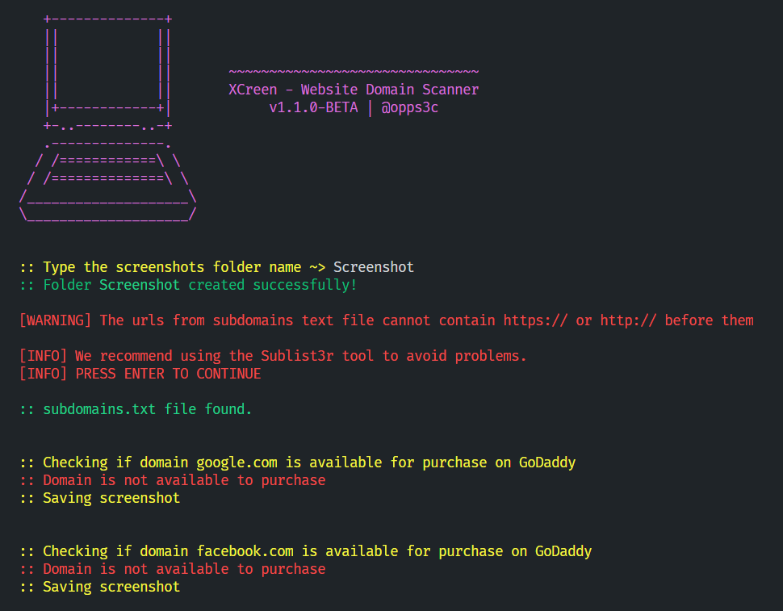

# XCreen 📷



<br><br>

[](https://opensource.org/licenses/MIT)
[](https://github.com/oppsec/xcreen/issues)
[](https://twitter.com/oppsec)

**XCreen** or **xcreen** is a Python CLI tool with the objective of automating the process of analyzing several domains or subdomains quickly and in a short time.

<br><br>

## **⚠️ WARNING: ONLY GOOGLE CHROME SUPPORT FOR NOW**
## ⚡ Installing / Getting started

A quick guide of how to install and use XCreen.

```shell
1. Clone the repository with git clone https://github.com/oppsec/xcreen.git
2. Install the libraries with pip install -r requirements.txt
3. Execute XCreen with python main.py (python 3)
4. XCreen will start.
```

<br><br>

### ⚙️ Pre-requisites
- [Python 3](https://www.python.org/downloads/) installed on your machine.
- All libraries instaled. (pip install r requirements.txt)

<br><br>

### 🔨 Contributing

A quick guide of how to contribute with the project.

```shell
1. Create a fork from XCreen repository.
2. Download the project with git clone https://github.com/your/xcreen.git
3. cd xcreen-folder/
4. Make your changes.
5. Commit and make a git push.
6. Open a pull request.
```

<br><br>

### ⚠️ Warning
- The developer is not responsible for any malicious use of this tool.
